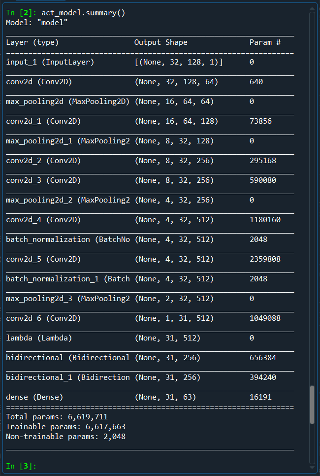
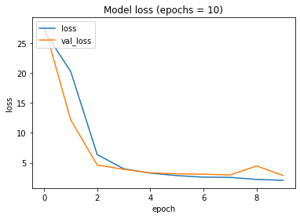

# OCR USING CRNN AND CTC LOSS FUNCTION

## Dataset
- Synthetic Word Dataset
- Link: https://www.robots.ox.ac.uk/~vgg/data/text/
- Direct download: https://thor.robots.ox.ac.uk/~vgg/data/text/mjsynth.tar.gz
- Dataset structure:

```
mnt
└───ramdisk
    └───max
        └───90kDICT32px
            ├───1
            │   ├───1
            │   ├───2
            │   ├───3
            │   ├───4
            │   ├───5
            │   ├───6
            │   └───7
            .
            .
            ├───3000
            │   ├───1
            │   ├───2
            │   ├───3
            │   ├───4
            │   ├───5
            │   ├───6
            │   └───7
            .
            .
            ├───3001
            ├───3002
            ├───3003
            .
            .
            └───4000
```

## Model
- Test set : Validate set = 90: 10
- Epochs = 10
- Summary:



## Results
- Loss:



- Test accuracy:
```
Test accuracy (%):  68.74666666666667
```
